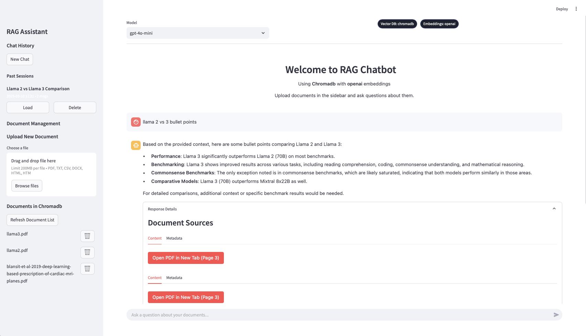

# Langchain RAG Chatbot

A full-stack Retrieval-Augmented Generation (RAG) chatbot with FastAPI (backend) and Streamlit (frontend). It supports multiple chats, document uploads (with deletion), and lets users choose an LLM for answering questions based on uploaded documents.



## Features
- **Chat Interface**: Simple and interactive chat with streaming responses.
- **Document Handling**: Upload, view, and delete PDFs, DOCX, and HTML files.
- **Session Management**: Create, save, and switch between multiple chat sessions.
- **Model Selection**: Choose between different OpenAI models (gpt-4o-mini, gpt-4o).
- **Vector Database Options**: Use ChromaDB (default) or Pinecone for document storage.
- **Embedding Model Options**: Choose between OpenAI and Hugging Face embedding models.
- **Source Attribution**: View source documents used for generating responses.

## Architecture Overview

The application follows a client-server architecture with clear separation of concerns:

- **Frontend (Streamlit)**
  - User interface for chat, document management, and model selection
  - Communicates with backend via REST API calls
  - Handles presentation logic and user state management

- **Backend (FastAPI)**
  - REST API for chat, document management, and file serving
  - Implements the RAG pipeline using LangChain
  - Manages database connections and vector stores
  - Handles document processing and indexing

- **Database Layer**
  - SQLite for relational data (sessions, chat history, document metadata)
  - Vector databases (ChromaDB/Pinecone) for semantic search functionality

## Key Features in Detail

- **RAG Implementation**: The application uses LangChain to implement a RAG pipeline:
  - Documents are chunked into smaller pieces with appropriate overlaps
  - Chunks are embedded using state-of-the-art embedding models
  - Semantic search finds the most relevant chunks for user queries
  - Retrieved chunks are fed into the LLM with appropriate prompting

- **Multi-Model Support**: The application is designed to be model-agnostic:
  - LLM options include OpenAI's latest models
  - Embedding options include both OpenAI and open-source alternatives (from HuggingFace)
  - Vector database options include local (ChromaDB) and cloud (Pinecone) solutions

- **Persistent Sessions**: All chat sessions are saved to the database, allowing users to:
  - Create multiple chat sessions with titles generated for each chat
  - Resume conversations at any point
  - Manage their chat history efficiently

- **Source Citations**: When answering questions, the application shows:
  - Which documents were used to generate the response
  - Relevant excerpts from those documents
  - Metadata about the source (filename, page numbers, etc.)

## Data Flow

1. **Document Processing**:
   - User uploads a document through the Streamlit frontend
   - Document is saved to the server and metadata stored in SQLite
   - Document is processed (loaded, chunked, embedded) based on selected models
   - Embeddings are stored in the selected vector database (ChromaDB/Pinecone)

2. **Query Processing**:
   - User submits a question in the chat interface
   - Question and session ID are sent to the backend API
   - Backend contextualizes the question using chat history
   - Relevant document chunks are retrieved from the vector database
   - LLM generates a response using the question, context, and chat history
   - Response is returned to the frontend with source attribution
   - Chat history is updated in the database

3. **Session Management**:
   - User sessions are created with unique IDs
   - Chat history is stored and retrieved using session IDs
   - Users can create, switch between, and delete sessions

## Tech Stack
- **Backend:**
   - [FastAPI](https://fastapi.tiangolo.com/): For building the RESTful API.
   - [LangChain](https://www.langchain.com/): For implementing the RAG pipeline, including document processing, retrieval, and response generation.
   - [OpenAI API](https://openai.com/api/): Used as the Large Language Model (LLM) for question answering and contextualization.
   - [Sentence Transformers](https://www.sbert.net/): Used for generating document embeddings (alternative to OpenAI embeddings).
- **Frontend:**
   - [Streamlit](https://streamlit.io/): For creating the interactive web user interface.
- **Database:**
   - [SQLite](https://www.sqlite.org/index.html): For storing conversation history (session data) and document metadata. 
   - [ChromaDB](https://www.trychroma.com/): Vector database for storing document embeddings and enabling efficient semantic search.
   - [Pinecone](https://www.pinecone.io/): Alternative vector database option.
- **Debugging/Tracing:**
   - [LangSmith](https://smith.langchain.com/): Used to debug and trace the LangChain components of the application

## Setup and Installation

### Prerequisites

- [Conda](https://docs.conda.io/projects/conda/en/latest/user-guide/install/index.html) or Python 3.10+

### Steps to Run the Application

1. **Clone the Repository**

   ```bash
   git clone <repository-url>
   cd <repository-directory>
   ```

2. **Create and Activate Conda Environment**

   ```bash
   conda create --name rag-application python=3.10
   conda activate rag-application
   ```

3. **Install Dependencies**

   ```bash
   pip install -r backend/requirements.txt
   ```

4. **Set Up Environment Variables**

   Create a `.env` file in the project directory with the following content:

   ```plaintext
   OPENAI_API_KEY="your-openai-api-key"
   LANGCHAIN_TRACING_V2=true
   LANGCHAIN_API_KEY="your-langchain-api-key"
   LANGCHAIN_PROJECT="rag-application"
   
   # Optional for Pinecone (if you want to use Pinecone as vector DB)
   PINECONE_API_KEY="your-pinecone-api-key"
   PINECONE_ENVIRONMENT="your-pinecone-environment" # e.g., "gcp-starter"
   PINECONE_INDEX_NAME="your-pinecone-index-name"
   ```

5. **Run the Backend Server**

   Navigate to the `backend` directory and start the FastAPI server:

   ```bash
   cd backend
   uvicorn main:app --reload
   ```

6. **Run the Frontend Application**

   In a new terminal, navigate to the `frontend` directory and start the Streamlit app:

   ```bash
   cd frontend
   streamlit run app.py
   ```

7. **Access the Application**

   Open your web browser and go to `http://localhost:8501` to interact with the chatbot.

## Usage

- **Upload Documents**: Use the sidebar to upload PDFs, DOCX, and HTML files for indexing.
- **Chat**: Enter your queries in the chat input and receive responses from the selected model.
- **Manage Documents**: View and delete documents from the sidebar.
- **Session Management**: Create new chat sessions, switch between sessions, or delete sessions.
- **Model Selection**: Choose LLM model, vector database, and embedding model from the sidebar.
- **LangSmith Trace**: Visualize the chat pipeline by logging into LangSmith.


- **FastAPI Docs**: Open `localhost:8000/docs` to view FastAPI - Swagger UI


## Logging

- Application logs are stored in `backend/app.log` for debugging and monitoring purposes.
- Log in to [LangSmith](https://smith.langchain.com) to view detailed traces of the RAG pipeline.

<!-- ## Reference

- [Langchain RAG Course](https://github.com/PradipNichite/Youtube-Tutorials/tree/main/Langchain%20RAG%20Course%202024): Used as a starting point and then added several features (multiple chat sessions, streaming responses, etc) -->