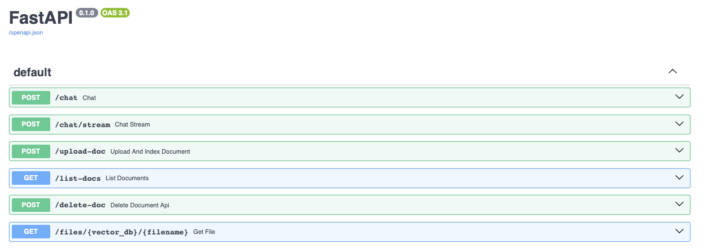

# Langchain RAG Chatbot

A full-stack Retrieval-Augmented Generation (RAG) chatbot built with FastAPI (backend) and Streamlit (frontend). It allows users to upload documents, ask questions about them, and receive AI-generated answers based on document content.


## Tech Stack

- **Backend:**
   - [FastAPI](https://fastapi.tiangolo.com/): RESTful API with efficient request handling
   - [LangChain](https://www.langchain.com/): RAG pipeline implementation
   - [OpenAI API](https://openai.com/api/): LLM for question answering
   - [Sentence Transformers](https://www.sbert.net/): Alternative document embeddings

- **Frontend:**
   - [Streamlit](https://streamlit.io/): Interactive web interface

- **Database:**
   - [SQLite](https://www.sqlite.org/index.html): Chat history and document metadata
   - [ChromaDB](https://www.trychroma.com/): Local vector database
   - [Pinecone](https://www.pinecone.io/): Cloud vector database option

- **Debugging/Tracing:**
   - [LangSmith](https://smith.langchain.com/): Debug and trace LangChain components
   

## Key Features

- **Interactive Chat Interface**: Chat with streaming responses
- **Document Management**: Upload, view, and delete PDFs, DOCX, and HTML files
- **Multi-Session Support**: Create and manage multiple chat sessions
- **Model Selection**: Choose between GPT-4o and GPT-4o-mini
- **Vector Database Options**: Use ChromaDB (local) or Pinecone (cloud)
- **Embedding Model Options**: OpenAI or HuggingFace models (local) or OpenAI (cloud)
- **Source Attribution**: View source documents used for responses

## Setup and Installation

### Prerequisites

- [Conda](https://docs.conda.io/projects/conda/en/latest/user-guide/install/index.html) or Python 3.10+

### Steps to Run the Application

1. **Clone the Repository**

   ```bash
   git clone <repository-url>
   cd <repository-directory>
   ```

2. **Create and Activate Conda Environment**

   ```bash
   conda create --name rag-application python=3.10
   conda activate rag-application
   ```

3. **Install Dependencies**

   ```bash
   pip install -r backend/requirements.txt
   ```

4. **Set Up Environment Variables**

   Create a `.env` file in the project directory with:

   ```plaintext
   OPENAI_API_KEY="your-openai-api-key"
   LANGCHAIN_TRACING_V2=true
   LANGCHAIN_API_KEY="your-langchain-api-key"
   LANGCHAIN_PROJECT="rag-application"
   
   # Optional for Pinecone
   PINECONE_API_KEY="your-pinecone-api-key"
   PINECONE_ENVIRONMENT="your-pinecone-environment"
   PINECONE_INDEX_NAME="your-pinecone-index-name"
   ```

5. **Run the Backend Server**

   ```bash
   cd backend
   uvicorn main:app --reload
   ```

6. **Run the Frontend Application**

   In a new terminal:

   ```bash
   cd frontend
   streamlit run app.py
   ```

7. **Access the Application**

   Open `http://localhost:8501` in your browser

## Usage

- **Upload Documents**: Use the sidebar to upload PDFs, DOCX, and HTML files
- **Chat**: Enter queries in the chat input and receive AI responses
- **Manage Documents**: View and delete documents from the sidebar
- **Session Management**: Create, switch between, and delete chat sessions
- **Model Selection**: Choose your preferred LLM, vector database, and embedding model
- **LangSmith Trace**: View detailed pipeline traces at [LangSmith](https://smith.langchain.com)
- **API Documentation**: Access Swagger UI at `localhost:8000/docs`



## Implementation Details

### Application Architecture

The application follows a client-server architecture with:

- **Frontend (Streamlit)**
  - User interface for chat, document management, and settings
  - Communicates with the backend via REST API calls
  - Manages UI state and user interactions

- **Backend (FastAPI)**
  - REST API endpoints for chat, document management, and file serving
  - RAG pipeline implementation using LangChain
  - Document processing and indexing
  - Database management

### Data Flow

1. **Document Processing**:
   - Document uploads are processed in chunks with appropriate overlaps
   - Chunks are embedded using the selected embedding model
   - Embeddings are stored in the vector database with metadata

2. **Query Processing**:
   - User questions are contextualized using chat history
   - Relevant document chunks are retrieved from the vector database
   - LLM generates responses using the question, context, and history
   - Responses are streamed to the frontend with source attribution
   - Conversations are stored in the database

### Database Schema

The application uses SQLite with three primary tables:

1. **application_logs**: Chat message history
2. **document_store**: Document metadata
3. **sessions**: Chat session configuration and state

### Logging

- Application logs are stored in `backend/app.log`
- LangSmith provides detailed tracing of the RAG pipeline execution

## To do
- Make documents accessible per chat session
- Deploy to AWS